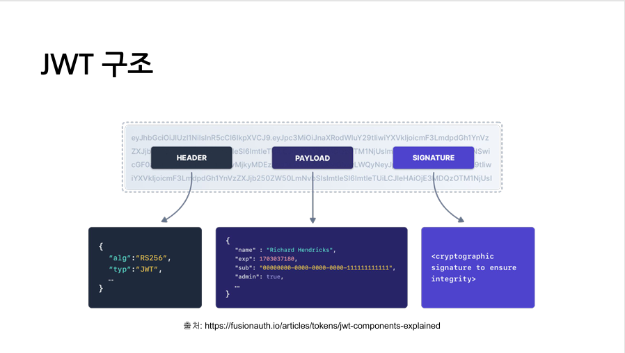

# JWT(JSON Web Token) 

## 정의
- JSON 객체를 사용하여 정보를 안전하게 전송하기 위한 **토큰 기반 인증 방식**이다.

- payload를 포함
- 서버에 세션을 저장하지 않는 stateless 인증 방식

## 구성 요소

### 1. Header
## 토큰 타입과 서명 알고리즘 정보 포함
- "alg" : HS256, RS256 같은 알고리즘 포함
- "typ" : 토큰 타입

### 2. Payload
## 실제 데이터 포함
- iss : 발급자
- sub : 사용자 ID
- exp : 만료 시간
- role : 권한

### 3. 서명 
## 토큰 위변조 방지 

## JWT 장단점

### 장점
- 무상태 인증 : 서버가 세션을 유지할 필요 없음
- 확장성 : 다양한 서비스에서 쉽게 통합 가능

### 단점
- 크기가 크므로 반복적으로 보내는 경우 성능 이유 발생
- 만료되지 않은 토큰이 탈취되면 보안 문제가 발생

## 결론
### JWT는 서버가 상태를 저장하지 않고 인증을 처리하기 위한 서명 기반 토큰 인증 방식이다.